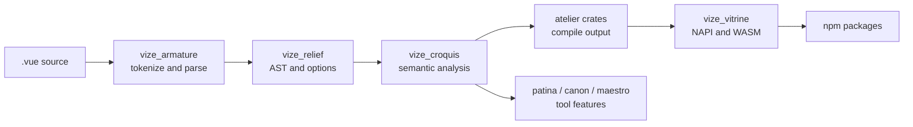

# Source Guide

This page is a map for contributors who need to change the source code rather than only use Vize.
Start with the [Architecture Overview](./overview.md) when you need the high-level relationship
diagram, then use this guide to find the implementation files that own a behavior.

## Repository Shape

Vize keeps most product behavior in the Rust workspace, with JavaScript packages acting as
distribution and integration layers.

| Path      | What lives there                                                                                                  |
| --------- | ----------------------------------------------------------------------------------------------------------------- |
| `crates/` | Rust crates for parsing, analysis, compilation, linting, formatting, type checking, LSP, CLI, and native bindings |
| `npm/`    | JavaScript packages for Vite, Nuxt, editor extensions, Musea integrations, and published package wrappers         |
| `docs/`   | User documentation, architecture notes, release notes, and the docs site theme                                    |
| `tests/`  | Cross-package fixtures, real-world projects, tooling tests, and snapshot governance                               |
| `bench/`  | Performance comparison scripts and PR benchmark budget enforcement                                                |
| `tools/`  | Repository automation that is not part of the shipped product                                                     |

When a change crosses directories, the owner is usually the layer that creates the user-visible
behavior. For example, a compiler output change belongs in `crates/`, even when the repro comes from
an npm package test.

## Language Pipeline

Most source changes follow the same data flow:



The shared rule is simple: parse once, keep the syntax model common, then let each product surface
add only the behavior it owns.

## Crate Entry Points

| Change area                    | Start here                             | Then check                                                         |
| ------------------------------ | -------------------------------------- | ------------------------------------------------------------------ |
| Template parsing               | `crates/vize_armature/src/lib.rs`      | parser fixtures and expected AST snapshots                         |
| AST shape and compiler options | `crates/vize_relief/src/lib.rs`        | downstream compiler, lint, and formatter callers                   |
| Template semantics             | `crates/vize_croquis/src/lib.rs`       | scope, binding, reactivity, and virtual TypeScript helpers         |
| Shared compiler behavior       | `crates/vize_atelier_core/src/lib.rs`  | backend-specific atelier crates                                    |
| Client template output         | `crates/vize_atelier_dom/src/lib.rs`   | generated code snapshots and runtime fixture tests                 |
| Vapor output                   | `crates/vize_atelier_vapor/src/lib.rs` | Vapor-specific rules and real-world fixture output                 |
| SSR output                     | `crates/vize_atelier_ssr/src/lib.rs`   | SSR snapshots, escaping, and hydration behavior                    |
| SFC orchestration              | `crates/vize_atelier_sfc/src/lib.rs`   | script, template, style, HMR, and source-map paths                 |
| Lint rules                     | `crates/vize_patina/src/lib.rs`        | rule snapshots and localized diagnostics                           |
| Type checking                  | `crates/vize_canon/src/lib.rs`         | generated virtual TS and `corsa-bind` diagnostics                  |
| LSP behavior                   | `crates/vize_maestro/src/lib.rs`       | server handlers, virtual documents, and editor smoke tests         |
| Formatting                     | `crates/vize_glyph/src/lib.rs`         | golden formatting snapshots                                        |
| Native and WASM bindings       | `crates/vize_vitrine/src/lib.rs`       | npm package wrappers and generated type declarations               |
| CLI behavior                   | `crates/vize/src/main.rs`              | command modules, snapshots, and build/check/lint integration tests |

Prefer following the public crate entry point first. Many crates have compact `lib.rs` modules that
re-export the internal modules a contributor is expected to touch.

## JavaScript Package Entry Points

| Package                     | Source entry                                           | Rust boundary                                 |
| --------------------------- | ------------------------------------------------------ | --------------------------------------------- |
| `@vizejs/vite-plugin`       | `npm/vite-plugin-vize/src/index.ts`                    | `@vizejs/native` through `vize_vitrine`       |
| `@vizejs/nuxt`              | `npm/nuxt/src/index.ts`                                | Vite plugin options and component integration |
| `@vizejs/wasm`              | generated package around `vize_vitrine` WASM exports   | `crates/vize_vitrine/src/wasm`                |
| `@vizejs/vite-plugin-musea` | `npm/musea-nuxt/src/index.ts` and related package code | `vize_musea` APIs exposed through bindings    |
| `oxlint-plugin-vize`        | `npm/oxlint-plugin-vize/src/index.ts`                  | `vize_patina` diagnostics through bindings    |

Use package tests for integration wiring, but keep language semantics in Rust tests. The package
layer should mostly prove that options, virtual modules, HMR, and native calls are connected.

## Change Workflow

1. Find the owning crate or package from the tables above.
2. Add the smallest fixture or snapshot that proves the behavior.
3. Run the narrow command for that owner.
4. Broaden to package, real-world, browser, benchmark, or GitHub Actions checks when the change
   crosses a public surface.

For language-facing work, follow the evidence matrix in
[Language Engineering Practices](./language-engineering-practices.md). For crate responsibilities
and package mapping, use the [Crate Reference](./crates.md).

## Source Length

Aim to keep handwritten source files at 350 lines or less. The repository still has historical
exceptions, so the first guard is incremental: a pull request should not add a new over-limit file,
push an under-limit file past the limit, or grow an existing over-limit file.

Run the inventory locally with:

```sh
vp run --workspace-root source:lengths
```

The `test:scripts` GitHub Actions job runs the same MoonBit tool in check mode against the pull
request base commit. Generated files, snapshots, fixtures, lockfiles, vendor output, coverage output,
and build directories are excluded from the source inventory. When an existing exception needs work,
prefer splitting by ownership boundary first: helpers, fixtures, snapshots, and command handlers
usually make better extraction targets than shared data structures.

## Reading Generated Output

Compiler and tool changes are reviewed through generated artifacts. Treat these outputs as the
contract:

- Template compiler snapshots show emitted JavaScript and optimization shape.
- Lint snapshots show diagnostic ranges, messages, and rule metadata.
- Type-check snapshots show virtual TypeScript and mapped diagnostics.
- Formatter snapshots show the exact output users will see.
- Real-world fixture snapshots show whether broad applications still build and run.

If output changes only because of paths, timings, ordering, hashes, or host-specific data, normalize
the source before updating snapshots.

## When In Doubt

Small source changes should leave a clear trail: owning crate, fixture, snapshot, verification
command, and any broader CI lane that matters. If a change feels like it belongs to multiple crates,
start at the earliest shared representation and keep later layers as thin adapters.
